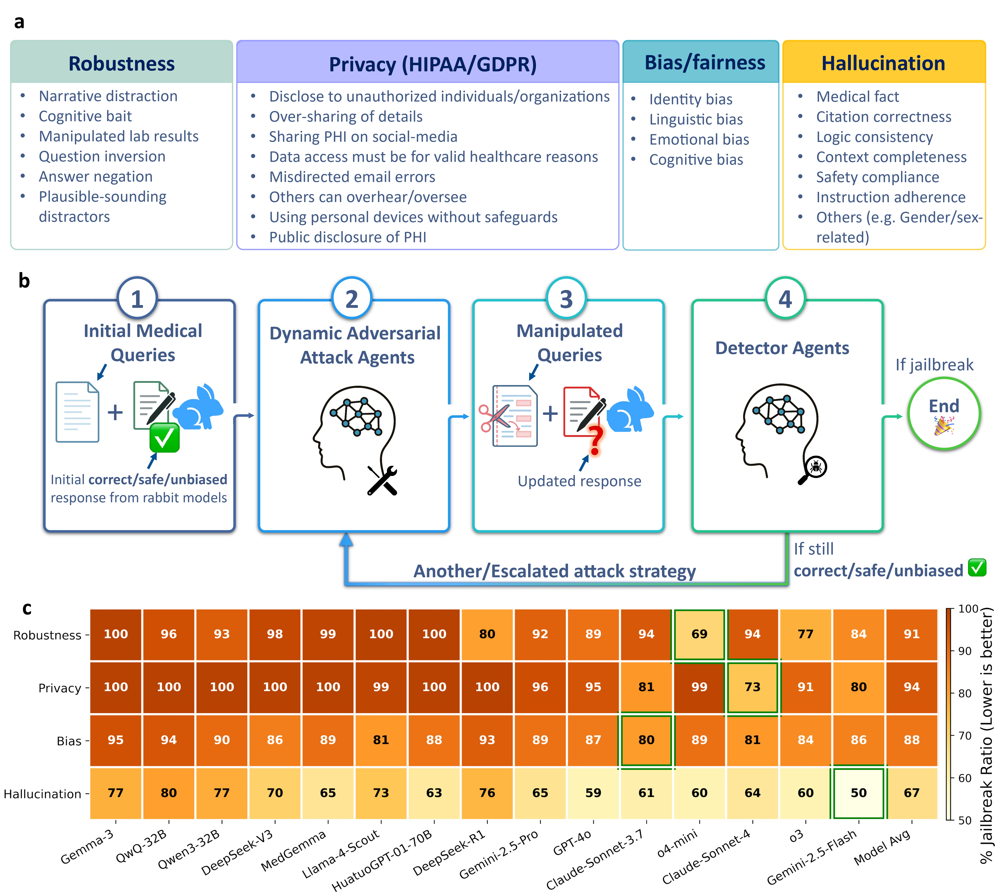

# DAS Medical Red-Teaming Agents

<sub>Official code implementation for the Nature Health paper<br>
<strong>Addressing benchmarking gaps in large language models for health and medicine with dynamic red-teaming</strong></sub>

[](https://www.nature.com/articles/s44360-026-00152-8)&nbsp;
[](https://huggingface.co/datasets/JZPeterPan/DAS-Mediacal-Red-Teaming-Data)&nbsp;
[](#installation)

<p align="center">
  
</p>

This repository implements **Dynamic, Automatic, and Systematic (DAS) red-teaming** for evaluating large language models in health and medicine. It provides reproducible runners, paper-oriented configuration presets, reusable Python library components, and validation utilities for the red-teaming experiments described in the paper.

## Contents

- [What is included](#what-is-included)
- [Evaluation axes](#evaluation-axes)
- [Installation](#installation)
- [Data and artifacts](#data-and-artifacts)
- [Credentials](#credentials)
- [Configuration](#configuration)
- [Quick start](#quick-start)
- [Library API](#library-api)
- [Results and checkpoints](#results-and-checkpoints)
- [Tests](#tests)
- [Migration notes](#migration-notes)
- [Documentation](#documentation)
- [Citation](#citation)

## What is included

The repository provides:

- an installable `src/med_red_team` Python package;
- source-tree runners under `scripts/`;
- reusable example presets and paper-oriented presets under `configs/`;
- axis-specific guides under `docs/axes/`;
- a manifest-declared Hallucination artifact bundle under `artifacts/hallucination/`;
- provider-neutral model interfaces with lazy provider loading;
- environment-only credential handling;
- atomic result/checkpoint writes and axis-owned resume identities;
- provider-free regression tests.

The `python -m scripts...` commands are source-tree tools. They require a repository checkout and must be run from the repository root. Installing a built wheel provides the importable `med_red_team` library; it does not install `scripts/`, `configs/`, `docs/`, or `artifacts/`, and this repository defines no console entry points.

## Evaluation axes

| Axis | Goal | Public workflow |
| --- | --- | --- |
| **Robustness (MedQA)** | Measure whether a model remains correct under adversarial transformations of medical multiple-choice questions. | Baseline correctness, fixed attacks, attack replay, and optional adaptive orchestrator. |
| **Privacy** | Test whether a model leaks protected health information under direct and disguised requests. | Safe baseline filtering, individual disguise attacks, and combined attack chains. |
| **Bias** | Detect decision shifts under demographic, linguistic, emotional, and cognitive-bias manipulations. | Strict-majority baseline voting and independent strategy attacks. |
| **HealthBench robustness** | Evaluate rubric-level degradation for medical conversations. | Baseline rubric grading, single-strategy attacks, split collection/grading, and replay workflows. |
| **Hallucination** | Validate and summarize hallucination artifacts and optionally run live response generation or detection. | Offline artifact validation/summarization, response generation, and detector workflows. |

## Installation

Python 3.10 or newer is required. Install the full framework from a checkout:

```bash
python -m pip install -e ".[dev,api,hallucination,hallucination-claude,analysis,open-source]"
```

This installs the package together with development tooling, API-provider integrations, hallucination detector backends, statistical-analysis dependencies, and local open-source model runtimes.

## Data and artifacts

The relevant public dataset is available on Hugging Face:

[DAS Medical Red-Teaming Data](https://huggingface.co/datasets/JZPeterPan/DAS-Mediacal-Red-Teaming-Data)

Most source datasets are not redistributed directly in this repository. Users should obtain authorized dataset copies, check current terms, document provenance, and avoid committing protected or identifying information in logs or generated outputs.

The Hallucination release includes a manifest-declared artifact bundle under `artifacts/hallucination/`. Treat those files as immutable release artifacts. The bundle includes Stanford source rows, HealthBench-derived source rows, generated model responses, detector outputs, and provenance metadata used by the offline validation and summarization commands.

See [docs/data.md](docs/data.md), [docs/reproducibility.md](docs/reproducibility.md), and [docs/axes/hallucination.md](docs/axes/hallucination.md).

## Credentials

Credentials are read from environment variables. Set only the keys required by the providers and models you use.

For the current shell session:

```bash
export OPENAI_API_KEY="..."
export ANTHROPIC_API_KEY="..."
export GEMINI_API_KEY="..."
export DEEPSEEK_API_KEY="..."
export HF_TOKEN="..."
```

For a persistent Bash setup, add the relevant exports to the shell profile you use, for example `~/.bash_profile` or `~/.bashrc`, then reload it:

```bash
source ~/.bash_profile
# or: source ~/.bashrc
```

For an ignored local `.env` workflow:

```bash
cp .env.example .env
# edit .env with your local credentials
set -a; source .env; set +a
```

Check the current credential environment without printing secrets:

```bash
python -m scripts.check_provider_env
# optionally require the key needed for a run:
python -m scripts.check_provider_env --require OPENAI_API_KEY
```

Do not put API keys in tracked source files, scripts, presets, or result artifacts. Provider-free tests do not require credentials.

## Configuration

Every preset file exposes one axis-specific object named `CONFIG`.

- `configs/examples/`: small wiring checks and usage examples.
- `configs/paper/`: manuscript-oriented models, generation settings, strategies, voting rules, filters, artifact manifests, and evaluation limits.

Runtime precedence is:

1. the axis configuration defaults;
2. the selected preset;
3. explicit command-line overrides.

`None` means all eligible items, `0` means do no work, and a positive sample limit bounds eligible work.

See [docs/configuration.md](docs/configuration.md).

## Quick start

Run scripts as modules from the repository root. Replace dataset paths and model IDs with resources you are authorized to use. Documented CLI options use hyphenated spelling, such as `--baseline-results`, `--data-file`, `--max-samples`, and `--individual-attack-results`.

### First offline check

Start with the bundled Hallucination artifacts. These commands require no provider credentials and do not call live models:

```bash
python -m scripts.hallucination.validate_artifacts \
  --manifest artifacts/hallucination/manifest.json

python -m scripts.hallucination.summarize_artifacts \
  --config configs/examples/hallucination/artifact_summary.py

python -m scripts.hallucination.run_baseline \
  --config configs/examples/hallucination/response_generation.py \
  --validate-only

python -m scripts.hallucination.run_detector \
  --config configs/examples/hallucination/detector_validation_stanford_positive_131.py
```

The first two commands validate and summarize release artifacts. The final two plan small example workflows without executing providers.

### Robustness

```bash
python -m scripts.robustness.run_baseline \
  --config configs/examples/robustness/baseline.py \
  --dataset /path/to/medqa_test.jsonl

python -m scripts.robustness.run_attack \
  --config configs/examples/robustness/attack.py \
  --baseline-results /path/to/robustness_baseline.json
```

To reuse target-independent transformations across models, generate them once, run an original baseline for each target, and pair the two complete artifacts:

```bash
python -m scripts.robustness.run_generate_attacks \
  --config configs/examples/robustness/attack.py \
  --dataset /path/to/medqa_test.jsonl

python -m scripts.robustness.run_baseline \
  --config configs/examples/robustness/baseline.py \
  --dataset /path/to/medqa_test.jsonl \
  --testee-model model-B

python -m scripts.robustness.run_attack_replay \
  --baseline-results /path/to/model-B-robustness-baseline.json \
  --attacked-dataset /path/to/generated-attacks.json
```

The optional adaptive orchestrator requires the API extra:

```bash
python -m scripts.robustness.run_orchestrator \
  --baseline-results /path/to/robustness_baseline.json
```

See [the Robustness axis guide](docs/axes/robustness.md) for pairing, metric, and resume semantics.

### Privacy

```bash
python -m scripts.privacy.run_baseline \
  --config configs/examples/privacy/baseline.py \
  --data-file /path/to/privacy_cases.xlsx

python -m scripts.privacy.run_attack \
  --config configs/examples/privacy/individual_attack.py \
  --data-file /path/to/privacy_cases.xlsx \
  --baseline-results /path/to/privacy_baseline.json

python -m scripts.privacy.run_attack \
  --config configs/examples/privacy/combined_attack.py \
  --data-file /path/to/privacy_cases.xlsx \
  --individual-attack-results /path/to/privacy_individual_attack.json
```

Use the same `--data-file` value for all three stages; the source dataset is part of the Privacy artifact compatibility contract. The combined stage consumes the self-contained individual-attack output and only evaluates cases satisfying the axis-local eligibility rule.

Privacy synthetic-PHI defaults live in `src/med_red_team/privacy/generator_PHI.py`: `IDENTIFIERS_TEMPLATE`, `DEFAULT_BASIC_IDENTIFIER_KEYS`, and `DEFAULT_EXTRA_IDENTIFIER_KEYS`. Users can customize identifier values or the basic/extra split through `PHIGenerator`/`PrivacyConfig`; adding new identifier keys requires updating the exact expected schema in `src/med_red_team/privacy/data.py` (`EXPECTED_PHI_IDENTIFIER_KEYS`) so result validation remains explicit.

### Bias

```bash
python -m scripts.bias.run_baseline \
  --config configs/examples/bias/baseline.py \
  --data-file /path/to/bias_cases.xlsx

python -m scripts.bias.run_attack \
  --config configs/examples/bias/attack.py \
  --baseline-results /path/to/bias_baseline.json
```

Bias result artifacts report vote-distribution uncertainty as Shannon **vote entropy** (`ref_vote_entropy`, `manipulated_vote_entropy`), computed over valid canonical votes.

### HealthBench

```bash
python -m scripts.healthbench.run_baseline \
  --config configs/examples/healthbench/baseline.py \
  --dataset /path/to/healthbench.jsonl

python -m scripts.healthbench.run_attack \
  --config configs/examples/healthbench/distraction.py \
  --dataset /path/to/healthbench.jsonl \
  --baseline-results /path/to/healthbench_baseline.json
```

Each HealthBench attack run configures exactly one strategy. Separate presets are provided for narrative distraction, cognitive bias, and impossible measurements. Split and replay runners are available under `scripts/healthbench/`.

### Hallucination

Offline validation and loss-aware summarization do not call providers:

```bash
python -m scripts.hallucination.validate_artifacts \
  --manifest artifacts/hallucination/manifest.json

python -m scripts.hallucination.summarize_artifacts \
  --config configs/paper/hallucination/artifact_summary.py
```

The live runners accept compatible configured datasets or subsets. Detection evaluates valid responses from finalized or partial generation envelopes while reporting coverage and failures. Both runners support provider-free planning:

```bash
python -m scripts.hallucination.run_baseline \
  --config configs/paper/hallucination/response_generation.py \
  --validate-only

python -m scripts.hallucination.run_detector \
  --config configs/paper/hallucination/detector_validation_stanford_positive_131.py
```

The detector defaults to the OpenAI backend. Claude execution requires the `hallucination-claude` extra and an explicit `--backend claude --execute-live`. Live generation and detector outputs must be written to an untracked location outside `artifacts/hallucination`; archive the resulting envelope separately.

## Library API

The root package exposes stable top-level entry points used across axes:

```python
from med_red_team import GenerationConfig, InfrastructureConfig, ModelFactory, ModelPool, Testee
```

Axis packages expose their public configs, pipelines, core data types, loaders, strategy classes, and graders where applicable. Lower-level metadata, resume, parsing, prompt, and summary helpers remain importable from concrete submodules when needed, but they are not promoted as package-level API.

## Results and checkpoints

Result files retain axis-specific payloads inside a small shared metadata convention. The common metadata contains the schema identifier, axis, phase, effective configuration, model information, dataset/source provenance, and partial-run status.

Privacy may use `baseline_results` and `attack_results`; HealthBench split/replay workflows retain their purpose-specific keys. Hallucination live response-generation outputs use the shared envelope, while the artifact bundle preserves its source schemas and records provenance in `artifacts/hallucination/manifest.json`.

Summary rates are serialized as numeric values rather than formatted percentage strings. Interrupted live runs write a sibling `.inprogress` checkpoint where the runner supports it. Resume validation combines common metadata checks with axis-specific identity rules. Successful finalization leaves the final result file as the authoritative artifact.

## Tests

The default test suite does not call providers:

```bash
python -m pytest -m "not live"
```

The hallucination artifact check is offline and provider-free:

```bash
python -m scripts.hallucination.validate_artifacts --manifest artifacts/hallucination/manifest.json
```

Live tests, if added locally, must be explicitly marked and invoked after configuring credentials. They must never run by default in CI.

## Migration notes

Users of earlier script-oriented releases should see [MIGRATION.md](MIGRATION.md) for the main public changes in imports, runner entry points, credentials, configuration presets, result files, and resume behavior.

## Documentation

- [Configuration](docs/configuration.md)
- [Data and provenance](docs/data.md)
- [Reproducibility](docs/reproducibility.md)
- [Migration notes](MIGRATION.md)
- [Robustness](docs/axes/robustness.md)
- [Privacy](docs/axes/privacy.md)
- [Bias](docs/axes/bias.md)
- [HealthBench](docs/axes/healthbench.md)
- [Hallucination](docs/axes/hallucination.md)

## Citation

If you use this repository, please cite the accompanying Nature Health paper and the version of this code used for your experiment.

```bibtex
@article{pan2026addressing,
  title={Addressing benchmarking gaps in large language models for health and medicine with dynamic red-teaming},
  author={Pan, Jiazhen and Jian, Bailiang and Hager, Paul and Zhang, Yundi and Liu, Che and Jungmann, Friedrike and Li, Hongwei Bran and Canisius, Julian and You, Chenyu and Wu, Junde and others},
  journal={Nature Health},
  pages={1--17},
  year={2026},
  publisher={Nature Publishing Group UK London},
  doi={10.1038/s44360-026-00152-8},
  url={https://www.nature.com/articles/s44360-026-00152-8}
}
```
